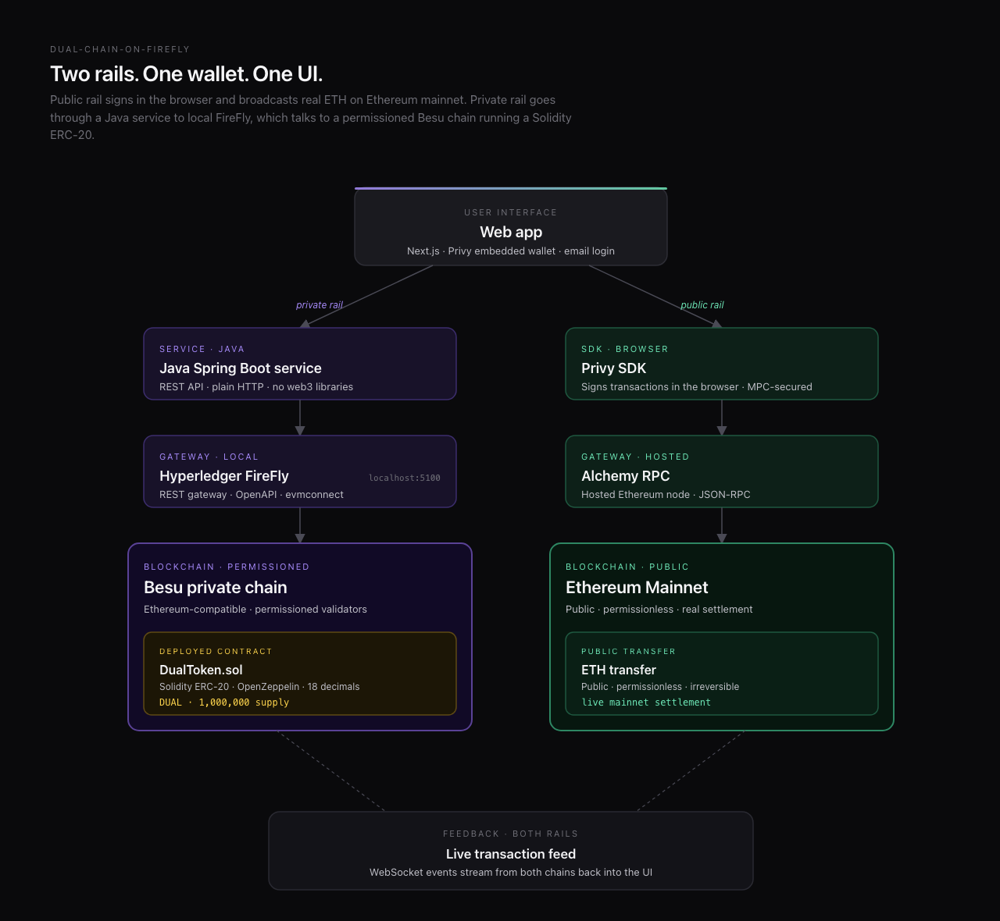
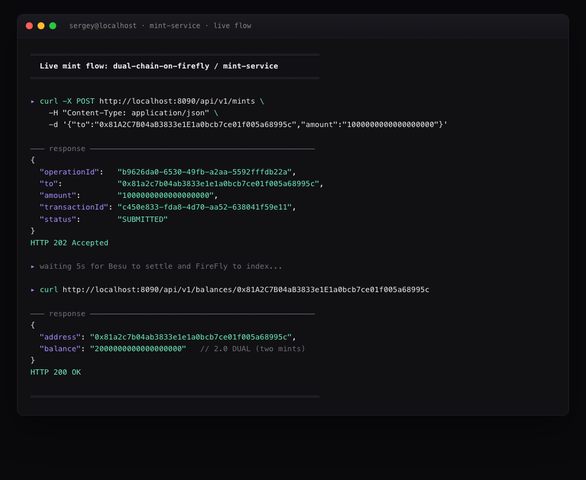
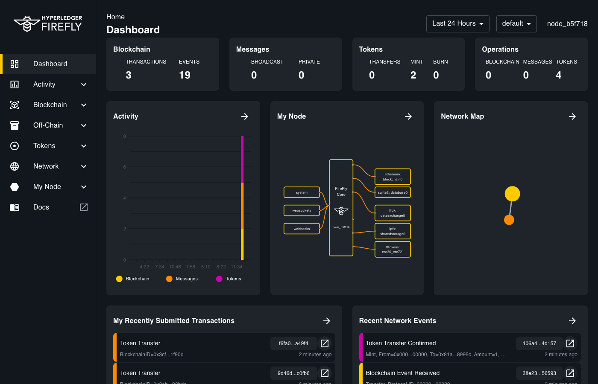
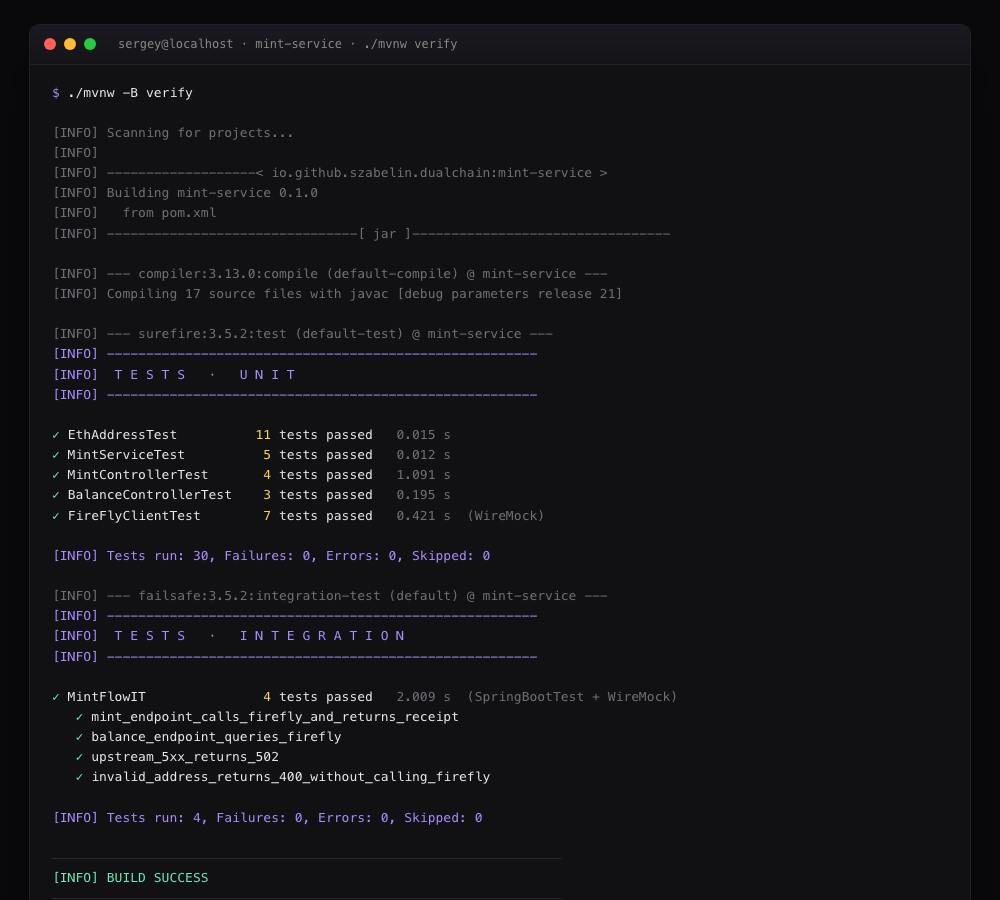

# dual-chain-on-firefly

A small crypto sandbox: one web app, one wallet, two blockchain rails.

- **Public rail** — the browser signs an ETH transfer and broadcasts it to **Ethereum mainnet** via Alchemy.
- **Private rail** — a Java service hits a local **Hyperledger FireFly** REST gateway, which mints an ERC-20 (`DUAL`) on a permissioned **Besu** chain.

Same UI, same wallet (Privy embedded, email login), two completely different settlement layers. I built it to feel out what public + permissioned chains look like when they live behind a single user experience — and to put real code behind the architecture rather than waving a slide at it.

## Architecture



## What's actually in this repo

| Path | What it is |
|---|---|
| `mint-service/` | Spring Boot 3.4 (Java 21) service that talks to FireFly's REST gateway. Handles the **private rail** — mint + balance lookups. Real tests, real integration tests. |
| `diagrams/` | Source HTML + rendered PNG for the architecture diagram. |
| `screenshots/` | Captured screenshots of the service and FireFly Explorer running locally. |

The public rail (Privy + Alchemy) lives entirely in the browser — no server code needed for it. The Java service is the interesting backend piece, so that's what this repo focuses on.

## Stack

| Layer | Tech | Why this |
|---|---|---|
| Frontend | Next.js 15, TypeScript, Tailwind, shadcn/ui | Standard, fast, low ceremony. |
| Auth + wallet | [Privy](https://www.privy.io/) embedded wallets, email login | MPC key shares so the user never sees a seed phrase, no browser extension, no `eth_requestAccounts` dance. Email → wallet in one step. |
| Public RPC | [Alchemy](https://www.alchemy.com/) (Ethereum mainnet) | Hosted node, generous free tier, reliable enough for real transfers. |
| Backend | Java 21, Spring Boot 3.4, RestClient (no web3 libs) | The service talks **plain HTTP** to FireFly. No `web3j`, no `ethers` — the gateway is the abstraction. |
| Private chain stack | Hyperledger FireFly → evmconnect → Besu (Clique PoA) | FireFly is the supernode pattern: REST API, OpenAPI spec, blockchain events as a stream. Run locally via the `firefly` CLI. |
| Contract | `DualToken` (FireFly's default ERC-20 with data, 18 decimals, symbol `DUAL`) | Deployed by FireFly when the token pool is created. |

### Why Privy

Two reasons:

1. **No seed phrases, no extensions.** The user signs in with email; Privy provisions a wallet whose private key is split via MPC between Privy, an HSM, and (optionally) the user. From the user's perspective it's "log in" — same as any web app.
2. **The same wallet address on every device.** Sign in with the same email from your phone and it's the same wallet. That's hard to do with a browser extension.

You could swap Privy for Magic, Web3Auth, Dynamic, or any other embedded-wallet provider — the architecture doesn't care. Privy was just the cleanest API I found.

### Why FireFly (and what about Kaleido?)

FireFly is the Hyperledger project's "supernode" abstraction. Instead of writing web3 code, your service talks REST to FireFly, and FireFly talks to the chain. It owns the signing key, the event stream, the contract registry. For a sample like this — where the interesting part is the **architecture**, not the chain interop — that's a huge win.

[**Kaleido**](https://www.kaleido.io/) (the company behind FireFly) sells a managed version: hosted FireFly nodes, hosted permissioned chain, all the operational toil taken care of. For a real product you'd almost certainly want that. For a self-contained sample you can `git clone` and run, the open-source FireFly CLI is the right call — everything spins up in Docker, no accounts, no API keys.

The Java code in `mint-service/` works against either: change `firefly.base-url` and you're done.

## Live flow

The mint-service exposes two endpoints. Hit them and FireFly does the work:



That's an actual mint hitting a live permissioned Besu chain on my laptop. The balance you see (`2000000000000000000` = 2.0 DUAL) is two consecutive mints — proof that it's reading the chain, not just echoing the request.

The same activity showing up in the FireFly Explorer UI:



`MINT 2` in the Tokens widget. The two Token Transfer events with `Mint, From=0x000...00000, To=0x81a...8995c, Amount=1` in the activity feed. Each one has a blockchain event ID — Besu emitted a real `Transfer(address,address,uint256)` log that FireFly picked up.

## Tests

The Java service ships with 34 tests across four levels:



- **`EthAddressTest`** — value object, parameterized for malformed inputs.
- **`MintServiceTest`** — pure unit tests on the domain layer, Mockito for the FireFly boundary.
- **`MintControllerTest` / `BalanceControllerTest`** — `@WebMvcTest` slice tests covering happy path + 400s from validation.
- **`FireFlyClientTest`** — drives the real `RestClient` against a WireMock server. Covers happy path, name → UUID resolution & caching, error wrapping (4xx, 5xx, 404).
- **`MintFlowIT`** — full `@SpringBootTest` with WireMock standing in for FireFly. End-to-end through controller → service → client → "FireFly" and back. Verifies the request body actually sent to FireFly matches what the contract expects.

Unit tests run on `mvn test`. Integration tests (`*IT.java`) run on `mvn verify` via the Failsafe plugin. Both run in CI on every push.

## How to run it yourself

### Prerequisites

| Tool | Why |
|---|---|
| **Docker Desktop** | FireFly's stack (Besu, evmconnect, postgres, ipfs, dataexchange) runs as 8 containers. |
| **[FireFly CLI](https://hyperledger.github.io/firefly/latest/gettingstarted/firefly_cli/)** (`brew install hyperledger/firefly/firefly-cli`) | Orchestrates the FireFly stack. |
| **Java 21** (Temurin, Zulu, whatever) | The service uses records, virtual threads, and other 21-isms. |
| **Maven** *(optional — the repo ships `./mvnw`)* | Build tool. |
| **curl** *(or any HTTP client)* | To poke the endpoints. |

### One-time setup

```bash
# 1. Spin up a local FireFly stack (8 containers)
firefly init dev
firefly start dev

# Sanity check — should return JSON
curl http://localhost:5100/api/v1/status

# 2. Create a DualToken ERC-20 pool on the private chain.
#    FireFly deploys the contract for you.
curl -X POST http://localhost:5100/api/v1/namespaces/default/tokens/pools \
  -H "Content-Type: application/json" \
  -d '{"type":"fungible","name":"DualToken","symbol":"DUAL"}'

# Wait ~5s for FireFly to deploy + activate, then confirm:
curl "http://localhost:5100/api/v1/namespaces/default/tokens/pools?name=DualToken"
```

### Run the service

```bash
cd mint-service

# Find your FireFly org wallet address (this is the signing key for mints):
curl -s http://localhost:5100/api/v1/status | python3 -c \
  "import sys,json;print(json.load(sys.stdin)['org']['identity'])"

# Run with that key as the signing-key:
./mvnw spring-boot:run \
  -Dspring-boot.run.arguments="--firefly.signing-key=0xYOUR_ORG_ADDRESS"
```

Service listens on `http://localhost:8090`.

### Exercise it

```bash
# Mint 1.0 DUAL to any address:
curl -X POST http://localhost:8090/api/v1/mints \
  -H "Content-Type: application/json" \
  -d '{"to":"0x81A2C7B04aB3833e1E1a0bcb7ce01f005a68995c","amount":"1000000000000000000"}'

# Check the balance:
curl http://localhost:8090/api/v1/balances/0x81A2C7B04aB3833e1E1a0bcb7ce01f005a68995c

# Watch it in the FireFly Explorer:
open http://localhost:5100/ui
```

### Run the tests

```bash
cd mint-service
./mvnw verify       # unit + integration tests, no FireFly needed (WireMock)
```

## Status

Personal exploration project. The mint-service is complete and tested end-to-end — both with WireMock and against a live FireFly stack. The frontend isn't in this repo (it's a thin Next.js + Privy app that any frontend dev can recreate from the architecture diagram in a couple of hours).

Pull requests welcome, but mostly this is here for anyone curious about what wiring up public + permissioned chains actually looks like in code.

## License

MIT
